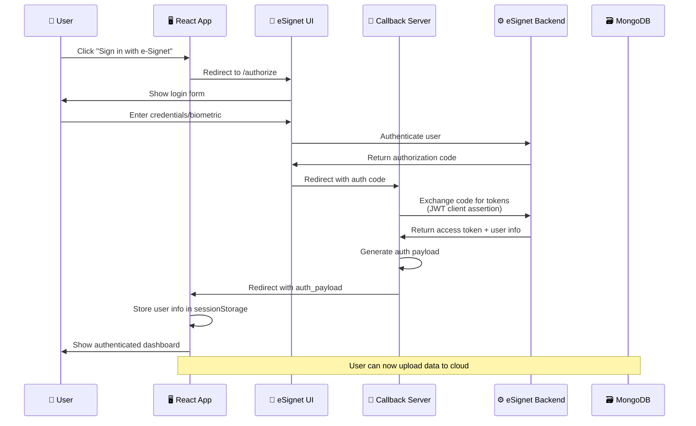
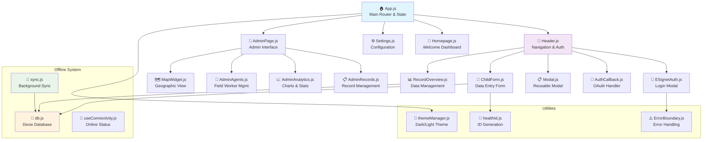
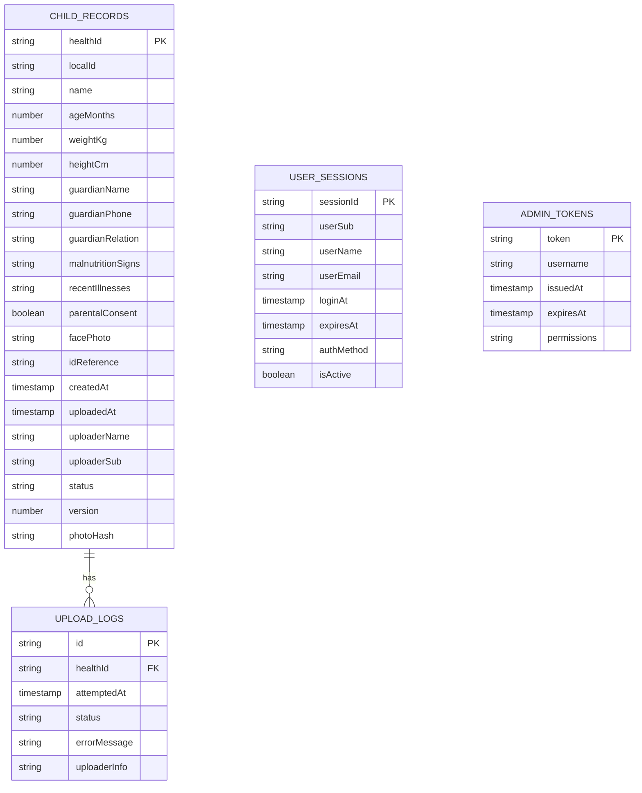
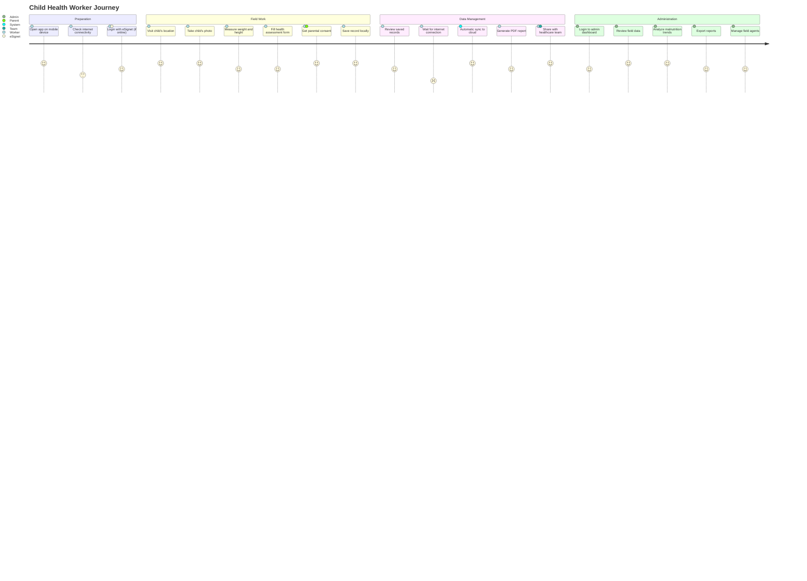
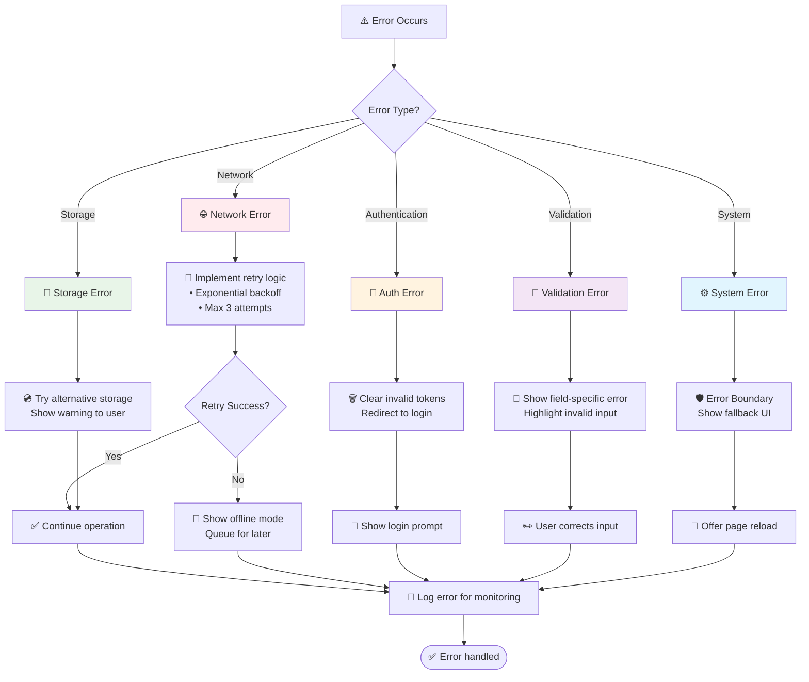
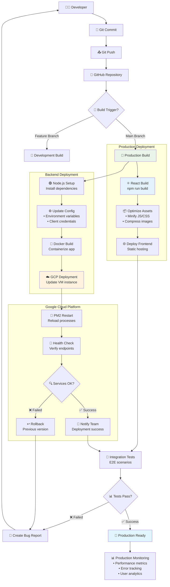

# ChildHealthBooklet - Application Flowcharts

## 🎯 Overview

This document contains comprehensive flowcharts that visualize the architecture, data flow, and user processes of the ChildHealthBooklet application.

## 📊 1. High-Level System Architecture Flow

```mermaid
graph TB
    subgraph "Local Development"
        ReactApp["🖥️ React App<br/>localhost:3001"]
    end
    
    subgraph "Google Cloud Platform"
        direction TB
        CallbackServer["🔄 Callback Server<br/>Node.js :5000"]
        eSignetUI["🎨 eSignet UI<br/>React :3000"]
        eSignetBackend["⚙️ eSignet Backend<br/>Spring Boot :8088"]
        BackendAPI["🟢 Backend API<br/>Node.js :8080 / Cloud Run"]
        
        subgraph "Supporting Services"
            PostgreSQL["🗄️ PostgreSQL<br/>:5432"]
            Redis["🚀 Redis Cache<br/>:6379"]
            MockIdentity["👤 Mock Identity<br/>:8082"]
        end
    end
    
    subgraph "Data Storage"
        IndexedDB["💾 IndexedDB<br/>(Offline)"]
        MongoDB["🗃️ MongoDB<br/>(Cloud)"]
    end
    
    ReactApp <-->|OAuth Flow| CallbackServer
    ReactApp <-->|Auth UI| eSignetUI
    ReactApp <-->|Local Storage| IndexedDB
    
    CallbackServer <-->|Token Exchange| eSignetBackend
    ReactApp -->|Sync (POST /api/child/batch)| BackendAPI
    BackendAPI <-->|Persist| MongoDB
    eSignetBackend <--> PostgreSQL
    eSignetBackend <--> Redis
    eSignetBackend <--> MockIdentity
    
    style ReactApp fill:#e1f5fe
    style CallbackServer fill:#f3e5f5
    style eSignetBackend fill:#e8f5e8
    style BackendAPI fill:#e8f5e8
    style MongoDB fill:#fff3e0
```

## 🔐 2. Authentication Flow



## 📝 3. Child Data Entry Flow

```mermaid
flowchart TD
    Start([👤 User opens app]) --> AuthCheck{Authenticated?}
    
    AuthCheck -->|No| GuestMode[🔓 Guest Mode<br/>Local storage only]
    AuthCheck -->|Yes| AuthMode[🔐 Authenticated Mode<br/>Full features]
    
    GuestMode --> AddChild
    AuthMode --> AddChild
    
    AddChild[➕ Click "Add Child"] --> FormStep1
    
    subgraph "Multi-Step Form"
        FormStep1[📋 Step 1: Identity<br/>• Name<br/>• Date of Birth<br/>• Gender<br/>• Photo<br/>• Aadhaar (optional)]
        FormStep2[📏 Step 2: Health Data<br/>• Weight & Height<br/>• Guardian info<br/>• Phone number<br/>• Malnutrition signs<br/>• Recent illnesses]
        FormStep3[✅ Step 3: Consent<br/>• Review data<br/>• Parental consent<br/>• Save confirmation]
        
        FormStep1 --> Validation1{Valid?}
        Validation1 -->|No| FormStep1
        Validation1 -->|Yes| FormStep2
        
        FormStep2 --> Validation2{Valid?}
        Validation2 -->|No| FormStep2
        Validation2 -->|Yes| FormStep3
        
        FormStep3 --> ConsentCheck{Consent given?}
        ConsentCheck -->|No| FormStep3
        ConsentCheck -->|Yes| SaveRecord
    end
    
    SaveRecord[💾 Save to IndexedDB] --> GenerateID[🔢 Generate Health ID<br/>(offline-safe 12-char)]
    GenerateID --> SetStatus[📊 Set Status: "pending"]
    SetStatus --> ShowSuccess[✅ Show success message]
    
    ShowSuccess --> BackgroundSync
    
    subgraph "Background Sync Process"
        BackgroundSync{📡 Online & Authenticated?}
        BackgroundSync -->|No| WaitForConnection[⏳ Wait for connectivity]
        BackgroundSync -->|Yes| UploadToCloud[🚀 POST to Backend API<br/>/api/child/batch]
        
        WaitForConnection --> BackgroundSync
        UploadToCloud --> UpdateStatus[📊 Update Status: "uploaded"]
    end
    
    style FormStep1 fill:#e3f2fd
    style FormStep2 fill:#f3e5f5
    style FormStep3 fill:#e8f5e8
    style SaveRecord fill:#fff3e0
```

## 🔄 4. Data Synchronization Flow

```mermaid
flowchart TD
    Timer[⏰ 15-second interval] --> ConnectivityCheck{🌐 Online?}
    
    ConnectivityCheck -->|No| WaitOffline[📴 Wait offline]
    WaitOffline --> Timer
    
    ConnectivityCheck -->|Yes| AuthCheck{🔐 Authenticated?}
    AuthCheck -->|No| WaitAuth[🔒 Wait for auth]
    WaitAuth --> Timer
    
    AuthCheck -->|Yes| GetPendingRecords[📋 Get pending records<br/>from IndexedDB]
    
    GetPendingRecords --> HasRecords{📊 Has records?}
    HasRecords -->|No| NoSync[✅ Nothing to sync]
    NoSync --> Timer
    
    HasRecords -->|Yes| UpdateStatus1[📊 Mark as "uploading"]
    UpdateStatus1 --> PreparePayload[📦 Prepare batch payload<br/>• Records array<br/>• Uploader info]
    
    PreparePayload --> SendToAPI[🚀 POST Backend API<br/>/api/child/batch (Bearer token)]
    
    SendToAPI --> APIResponse{📡 Response OK?}
    
    APIResponse -->|❌ Failed| HandleError[⚠️ Handle error<br/>• Mark as "failed"<br/>• Show toast notification]
    APIResponse -->|✅ Success| ProcessResults[📊 Process response]
    
    HandleError --> Timer
    
    ProcessResults --> UpdateRecords
    
    subgraph "Update Record Status"
        UpdateRecords[🔄 For each record result:]
        UpdateRecords --> CheckResult{Status?}
        CheckResult -->|"uploaded"| MarkUploaded[✅ Mark as "uploaded"<br/>Set uploadedAt timestamp]
        CheckResult -->|"failed"| MarkFailed[❌ Mark as "failed"<br/>Will retry next cycle]
        CheckResult -->|"duplicate"| MarkUploaded
    end
    
    MarkUploaded --> CleanupOld[🧹 Cleanup old uploaded<br/>records (7-day retention)]
    MarkFailed --> CleanupOld
    
    CleanupOld --> ShowNotification[📢 Show sync notification<br/>• Success count<br/>• Failed count]
    
    ShowNotification --> UpdateUI[🔄 Update UI counters<br/>• Pending uploads<br/>• Total records]
    
    UpdateUI --> Timer
    
    style UpdateStatus1 fill:#fff3e0
    style SendToAPI fill:#e3f2fd
    style MarkUploaded fill:#e8f5e8
    style MarkFailed fill:#ffebee
```

## 🏛️ 5. Application Component Architecture



## 📊 6. Database Schema & Relationships



## 🎭 7. User Journey Flow



## 🔄 8. Error Handling & Recovery Flow



## 🚀 9. Deployment & CI/CD Flow



## 📱 10. Mobile PWA Installation Flow

```mermaid
flowchart TD
    UserVisit[👤 User visits app URL] --> BrowserCheck{📱 Mobile browser?}
    
    BrowserCheck -->|No| DesktopExperience[💻 Desktop experience<br/>Full functionality]
    BrowserCheck -->|Yes| PWACheck[🔍 Check PWA support]
    
    PWACheck --> ServiceWorker[⚙️ Register Service Worker<br/>Enable offline features]
    ServiceWorker --> ManifestLoad[📋 Load Web App Manifest<br/>App metadata & icons]
    ManifestLoad --> CacheAssets[💾 Cache critical assets<br/>• HTML, CSS, JS<br/>• Icons, fonts]
    
    CacheAssets --> InstallPrompt{💡 Show install prompt?}
    InstallPrompt -->|User interested| ShowBanner[🎗️ Show install banner<br/>"Add to Home Screen"]
    InstallPrompt -->|Not now| WebAppMode[🌐 Continue as web app]
    
    ShowBanner --> UserAction{👆 User action?}
    UserAction -->|Install| InstallPWA[📲 Install PWA<br/>Add to home screen]
    UserAction -->|Dismiss| WebAppMode
    
    InstallPWA --> AppIcon[📱 Create app icon<br/>Native-like experience]
    AppIcon --> OfflineReady[📴 Offline-ready app<br/>Full functionality without internet]
    
    WebAppMode --> OfflineCapable[💿 Offline-capable web app<br/>Service worker active]
    OfflineReady --> AppLaunch[🚀 Launch app<br/>Splash screen]
    OfflineCapable --> AppLaunch
    DesktopExperience --> AppLaunch
    
    AppLaunch --> InitialLoad[⚡ Initial load<br/>• Check authentication<br/>• Load cached data<br/>• Start sync service]
    
    InitialLoad --> ReadyToUse[✅ App ready to use<br/>Offline-first experience]
    
    style InstallPWA fill:#e8f5e8
    style OfflineReady fill:#e3f2fd
    style ReadyToUse fill:#e1f5fe
```

## 🛡️ 11. Admin Dashboard & Records Management Flow

```mermaid
flowchart TD
    Start[👤 Admin opens /admin] --> Login[🔐 Enter credentials]
    Login --> PostLogin[🚀 POST /api/admin/login]
    PostLogin -->|200 OK| StoreToken[🗝️ Save token (Bearer)]
    PostLogin -->|401| LoginError[❌ Invalid credentials]
    LoginError --> Login

    StoreToken --> Dashboard[📊 Admin Dashboard]
    Dashboard --> GetStats[📈 GET /api/admin/stats]
    GetStats --> ShowStats[📊 Show totals + recent uploads]

    Dashboard --> ViewRecords[📋 Records]
    ViewRecords --> ListChildren[📥 GET /api/admin/children?page&limit&search]
    ListChildren --> ChildrenTable[🗂️ Render table]

    ChildrenTable --> ViewPDF[🧾 GET /api/child/:healthId/pdf]
    ChildrenTable --> EditRecord[✏️ Edit child]
    ChildrenTable --> DeleteRecord[🗑️ Delete child]

    EditRecord --> VerifyPwdPrompt[🧪 Verify password?]
    VerifyPwdPrompt -->|Yes| VerifyPwd[🧪 POST /api/admin/verify-password]
    VerifyPwdPrompt -->|No| SkipVerify[↩️]
    VerifyPwd -->|200 OK| PutUpdate[🔄 PUT /api/admin/child/:healthId]
    VerifyPwd -->|401| VerifyFail[❌ Wrong password]
    VerifyFail --> VerifyPwdPrompt
    SkipVerify --> PutUpdate
    PutUpdate --> RefreshList[🔁 Refresh list]

    DeleteRecord --> VerifyPwdDel[🧪 POST /api/admin/verify-password]
    VerifyPwdDel -->|200 OK| DoDelete[🗑️ DELETE /api/admin/child/:healthId]
    VerifyPwdDel -->|401| DelFail[❌ Wrong password]
    DoDelete --> RefreshList

    Dashboard --> Agents[👥 Admin Agents]
    Agents --> ListIdentities[📇 GET /api/admin/identities?limit&offset]
    ListIdentities --> IdentityDetail[🔍 GET /api/admin/identities/:id]

    style StoreToken fill:#e8f5e8
    style ShowStats fill:#e3f2fd
    style ChildrenTable fill:#fff3e0
```

---

## 📚 How to Use These Flowcharts

### For Developers:
- Use **Architecture Flow (#1)** to understand system components
- Follow **Authentication Flow (#2)** for OAuth implementation
- Reference **Component Architecture (#5)** for code structure
- Use **Admin Flow (#11)** to understand admin login, records management, identities, and PDF actions

### For Project Managers:
- Review **User Journey (#7)** for feature planning
- Use **Deployment Flow (#9)** for release planning
- Monitor **Error Handling (#8)** for quality assurance

### For QA Testers:
- Follow **Data Entry Flow (#3)** for testing scenarios
- Use **Error Handling (#8)** for edge case testing
- Reference **PWA Installation (#10)** for mobile testing

### For DevOps:
- Implement **Deployment Flow (#9)** for CI/CD
- Monitor **Data Synchronization (#4)** for performance
- Use **Database Schema (#6)** for infrastructure planning

---

## 🔧 Tools for Visualization

These flowcharts are written in **Mermaid** syntax and can be viewed in:
- **GitHub** (native support)
- **VS Code** (with Mermaid extension)
- **Mermaid Live Editor** (https://mermaid.live/)
- **GitLab** (native support)
- **Notion, Obsidian** (with plugins)

To render locally, install the Mermaid CLI:
```bash
npm install -g @mermaid-js/mermaid-cli
mmdc -i FLOWCHARTS.md -o flowcharts.html
```

---

**Last Updated**: September 28, 2025  
**Version**: 1.0.0  
**Compatible with**: ChildHealthBooklet v3.0.0